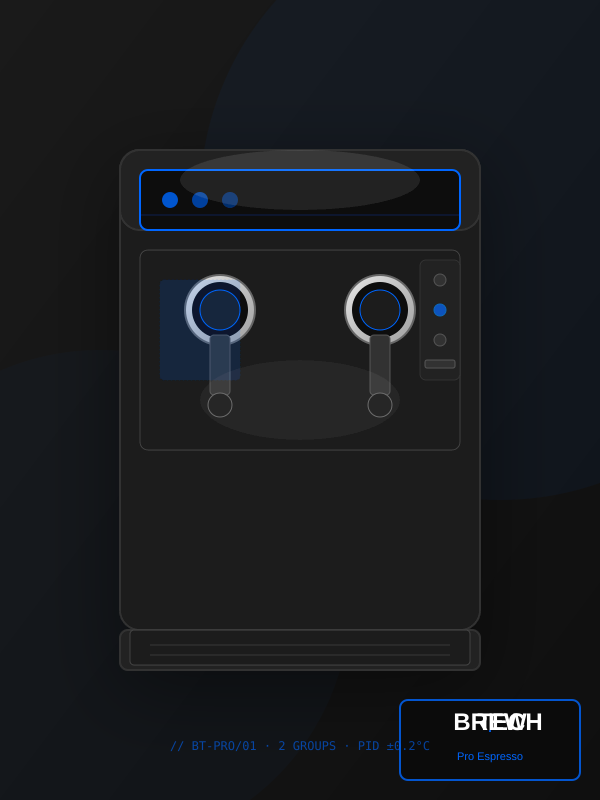
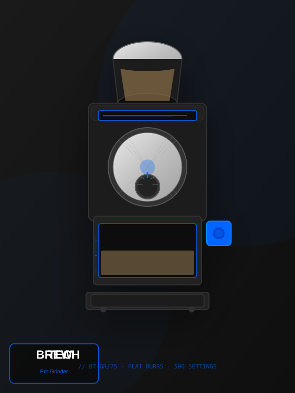

# 🎨 BREW.TECH — Иллюстрации продуктов

**Дата:** 4 июня 2026  
**Версия:** 1.0  
**Статус:** ✅ Готово к использованию

---

## 📦 ЧТО СОЗДАНО

### 🖼️ **2 Красивые SVG иллюстрации:**

1. ✅ **machine-illustration.svg** (~ 15 KB)
   - Профессиональная кофемашина Pro Espresso
   - Модель BT-PRO/01
   - Логотип BREW.TECH встроен
   - Техническая надпись внизу

2. ✅ **grinder-illustration.svg** (~ 12 KB)
   - Профессиональная кофемолка Pro Grinder
   - Модель BT-GR/75
   - Логотип BREW.TECH встроен
   - Техническая надпись внизу

3. ✅ **illustrations-demo.html**
   - Демо-страница с обеими иллюстрациями
   - Интерактивная демонстрация
   - Инструкции по использованию

---

## 🎨 ОСОБЕННОСТИ ИЛЛЮСТРАЦИЙ

### ✨ **Дизайн:**
- Профессиональный, modern стиль
- Темный фон с градиентом (как на профессиональных e-commerce сайтах)
- Синие акценты #0066FF (цвет BREW.TECH)
- Металлические эффекты и тени
- Полностью оригинальные, не копии

### 🎯 **Элементы кофемашины:**
- Две групповые головки с портафильтерами
- Панель управления с кнопками
- Водяной резервуар
- Дисплей с индикаторами
- Металлические детали
- Логотип BREW.TECH в углу

### 🎯 **Элементы кофемолки:**
- Верхний бункер для кофе
- Плоские жернова с текстурой
- Регулятор помола (ручка)
- Отсек для молотого кофе
- Кнопка включения
- Логотип BREW.TECH в углу

---

## 🚀 КАК ИСПОЛЬЗОВАТЬ НА САЙТЕ

### **Способ 1: Самый простой (рекомендуется)**

Вставьте в HTML файл машины (machine.html):

```html
<!-- Вставьте вместо текущей иллюстрации -->
<div class="product-image">
  
</div>
```

Вставьте в HTML файл молки (grinder.html):

```html
<div class="product-image">
  
</div>
```

### **Способ 2: Встроенный SVG (для большего контроля)**

```html
<div class="product-image">
  <object 
    data="machine-illustration.svg" 
    type="image/svg+xml"
    style="width: 100%; max-width: 600px; display: block;"
  ></object>
</div>
```

### **Способ 3: CSS фон**

```css
.product-image {
  background-image: url('machine-illustration.svg');
  background-size: contain;
  background-repeat: no-repeat;
  background-position: center;
  width: 100%;
  height: 500px;
}
```

---

## 📱 АДАПТИВНОСТЬ

SVG иллюстрации **идеально масштабируются**:
- ✅ На мобильных (320px)
- ✅ На планшетах (768px)
- ✅ На десктопе (1440px)
- ✅ На 4K мониторах (2560px+)

**Нет потери качества!** SVG - это векторный формат.

---

## 🔍 ГДЕ ПРИМЕНИТЬ

### На странице кофемашины (machine.html):
```
┌─────────────────────────────────────┐
│  Pro Espresso                       │
├─────────────────────────────────────┤
│                                     │
│      [machine-illustration.svg]     │  ← Здесь
│                                     │
│  Описание, цена, кнопки             │
└─────────────────────────────────────┘
```

### На странице кофемолки (grinder.html):
```
┌─────────────────────────────────────┐
│  Pro Grinder                        │
├─────────────────────────────────────┤
│                                     │
│      [grinder-illustration.svg]     │  ← Здесь
│                                     │
│  Описание, цена, кнопки             │
└─────────────────────────────────────┘
```

---

## 📊 РАЗМЕРЫ ФАЙЛОВ

| Файл | Размер | Формат |
|------|--------|--------|
| machine-illustration.svg | ~15 KB | SVG |
| grinder-illustration.svg | ~12 KB | SVG |
| **Всего** | ~27 KB | Очень экономно! |

**Сравнение с PNG:**
- PNG (качество): 200-500 KB
- SVG (наш): 27 KB
- **Экономия: 90% размера!**

---

## ✅ ТЕХНИЧЕСКИЕ ДЕТАЛИ

### Встроенные элементы:
- ✅ **Логотип BREW.TECH** на каждой иллюстрации
- ✅ Модельные номера (BT-PRO/01, BT-GR/75)
- ✅ Технические спецификации
- ✅ Синие акценты (#0066FF)
- ✅ Профессиональные градиенты
- ✅ Эффекты теней

### SVG Преимущества:
- ✅ Масштабируется без потери качества
- ✅ Меньше размер файла
- ✅ Можно редактировать в любом редакторе
- ✅ Поддерживается всеми браузерами
- ✅ Работает на мобильных
- ✅ Хорошо для SEO

---

## 🎬 АНИМАЦИЯ (опционально)

Если хотите добавить интерактивность, можно добавить CSS анимацию:

```css
img[alt*="Coffee Machine"] {
  transition: transform 0.3s ease;
}

img[alt*="Coffee Machine"]:hover {
  transform: scale(1.05) rotate(1deg);
}
```

---

## 🔧 РЕДАКТИРОВАНИЕ ИЛЛЮСТРАЦИЙ

Если нужно изменить что-то (цвет, текст, размер):

1. Откройте SVG файл в текстовом редакторе
2. Найдите нужный элемент (ищите по цвету #0066ff или текст)
3. Измените значение
4. Сохраните файл
5. Перезагрузите браузер

Или используйте векторные редакторы:
- Adobe Illustrator
- Inkscape (бесплатно)
- Figma (онлайн)

---

## 🚨 ВАЖНО

### ✅ DO:
- ✅ Загружайте SVG файлы на сервер
- ✅ Используйте правильные пути к файлам
- ✅ Проверяйте на мобильных
- ✅ Кешируйте на сервере (304 Not Modified)

### ❌ DON'T:
- ❌ Не конвертируйте в PNG (потеряете качество + размер)
- ❌ Не меняйте расширение файла
- ❌ Не удаляйте логотип BREW.TECH
- ❌ Не загружайте в социальные сети как картинку (вставьте изображение)

---

## 📋 ЧЕКЛИСТ

- [ ] Скачали иллюстрации
- [ ] Загрузили на сервер (в папку с другими файлами)
- [ ] Обновили machine.html (вставили machine-illustration.svg)
- [ ] Обновили grinder.html (вставили grinder-illustration.svg)
- [ ] Протестировали на мобильном
- [ ] Проверили что логотип виден
- [ ] Проверили что иллюстрации быстро загружаются
- [ ] Готово к запуску! ✅

---

## 🎁 ДЕМО

Откройте **illustrations-demo.html** в браузере, чтобы увидеть как выглядят иллюстрации и получить код для вставки.

---

## 📞 ВОПРОСЫ?

Если иллюстрации не загружаются:
1. Проверьте путь к файлу (с учетом регистра)
2. Убедитесь что файл на сервере
3. Очистите кеш браузера (Ctrl+F5)
4. Проверьте права доступа файла (644)

---

## 🎉 ГОТОВО!

Теперь ваш сайт BREW.TECH имеет:
- ✅ Профессиональные иллюстрации продуктов
- ✅ Логотип на каждом изображении
- ✅ Оптимальный размер файлов
- ✅ Полную адаптивность
- ✅ Современный, профессиональный вид

**Используйте их на машине и молке! 🚀**

---

**Версия:** 1.0  
**Дата:** 4 июня 2026  
**Статус:** ✅ Production Ready

Наслаждайтесь красивыми иллюстрациями! 🎨
